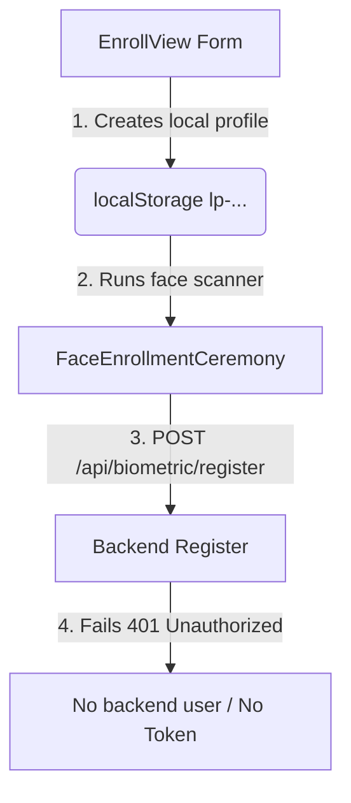
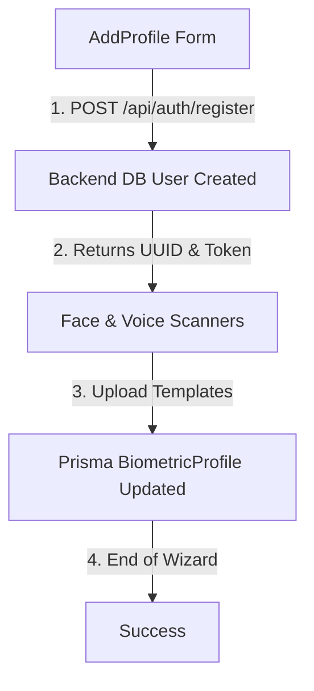

# Phase 2.1 — Authentication Identity & Registration Analysis

This document reports the Registration ↔ Login identity analysis, identifying the architectural mismatches between the client-side local profile registry and the backend database user model, and maps the path to a unified authentication entry system.

---

## 1. Registration Entry

### Flow and Entry Points:
1. **First-Time Setup:**
   - **Component:** [`FirstRunSetup.tsx`](file:///c:/Users/Amruth/Desktop/bioshield-mfa-2025%20v9%2031%20july/frontend/components/login/FirstRunSetup.tsx) redirects to [`EnrollView.tsx`](file:///c:/Users/Amruth%20/Desktop/bioshield-mfa-2025%20v9%2031%20july/frontend/components/login/EnrollView.tsx).
   - **User Input Fields:** `firstName`, `lastName`, `pin`, `confirmPin`, and `role`.
   - **Password:** No password or email is requested or entered.
   - **Validation:** PIN is validated client-side to ensure it is at least 4 digits and matches confirmation.
   - **Backend Call:** No backend call is executed at form submission. The profile is saved strictly to local browser storage.
2. **Subsequent Profiles (Admin Console):**
   - **Component:** [`AddProfile.tsx`](file:///c:/Users/Amruth/Desktop/bioshield-mfa-2025%20v9%2031%20july/frontend/components/profiles/AddProfile.tsx).
   - **User Input Fields:** `firstName`, `lastName`, `displayName`, `role`, `password`, and `confirmPassword`.
   - **Password:** Entered in the step 2 sub-screen.
   - **Validation:** Validated locally for length (>= 8 chars), matching, and verified on the backend by validator schema.
   - **Backend Call:** Sends `POST /api/auth/register` with email `${firstName.toLowerCase().trim()}.${lastName.toLowerCase().trim()}@bioshield.local` and the password.

---

## 2. Backend User Creation

The Node backend creates users via `AuthService.register` in `auth.service.ts`:
* **Endpoint:** `POST /api/auth/register` (and `POST /api/admin/users` via admin controllers).
* **Identifier:** The unique user `email`.
* **Password Hashing:** `CryptoService.hashPassword(parsed.password)` hashes the password using Argon2id before database insertion.
* **Storage:** Saved in the SQLite database `User` table, `passwordHash` field.
* **Metadata fields:** `role` (enum `Role` - `USER`, `ADMIN`), `status` (defaults to `ACTIVE` upon registration), and a UUID primary key `id`.
* **Biometric Enrollment Tokens:** Generates an `enrollmentToken` record (hashed with SHA-256) linked to the `User.id` and returns the raw token to authorize subsequent face/voice uploads.

---

## 3. Local Profile Creation

* **Purpose:** Local profiles in `localProfileService` simulate a secure local enclave/TPM workstation registry allowing multiple local desktop accounts to share a single computer and authenticate offline.
* **Profile IDs:** Generated in `localProfileService.ts` via `generateId()` (prefixes with `lp-`, e.g., `lp-a1b2c3d4-e5f6g7h8`).
* **PIN Storage:** Stored in the browser's `localStorage` (inside the registry array under key `bioshield_local_profiles_v2`) in plaintext under the `_devPin` field.
* **Backend Link:** **NONE**. In the existing codebase, local profiles in `localStorage` do not reference the backend database user ID or email.
* **Authentication Gate:** The local PIN acts as the actual first-factor verification. `PinUnlockView.tsx` executes:
  ```typescript
  const valid = localProfileService.validatePin(profile.id, pin);
  ```
  If `valid` is true, the UI assumes successful unlock and starts biometrics.

---

## 4. Current Registration ↔ Backend Identity Mapping Trace

### Scenario A: First-Time Setup (`EnrollView.tsx`)

* **Mismatch:** The face scanner is passed `profileId` = `lp-...` but there is no matching backend user. The API call fails on a strict backend, leaving biometrics unlinked.

### Scenario B: Subsequent Setup (`AddProfile.tsx`)

* **Mismatch:** A backend user is created and biometrics are enrolled, but **no local profile** is appended to `localStorage`. The selector screen remains empty of the new user.

---

## 5. Current Login Identity Mapping Trace

When logging in from the lock screen, the application performs a backwards identity conversion:

```text
1. Selector displays displayName from localStorage
2. User selects profile → resolves profile.id (e.g. "lp-12345")
3. User enters PIN → checked client-side by validatePin(profile.id, pin)
4. If PIN valid → App.tsx.handleCredentialsSuccess() runs:
     email = `${profile.id}@bioshield.local`
     password = "Password123!"
5. Frontend registers/logs in backend user with these hardcoded credentials
6. Node backend issues sessionId in CHALLENGE_REQUIRED state
```

---

## 6. Canonical User Identity

* **Recommendation:** **`email`** as the login identifier, and **`id`** (UUID) as the internal relational database key.
* The frontend must prompt for the user's `email` (or username) and password on login. The local `localStorage` profiles must carry the matching `email` and backend `userId` to bind them securely to the Node server.

---

## 7. Password Lifecycle & Hardcoded Keys

We identified the following instances of hardcoded passwords and local PIN checks in the code:

* **Hardcoded Passwords:**
  - [`frontend/App.tsx: Line 164`](file:///c:/Users/Amruth/Desktop/bioshield-mfa-2025%20v9%2031%20july/frontend/App.tsx#L164): `const password = "Password123!";` used to automatically authenticate all profiles.
  - [`backend/tests/e2e-gate.test.ts`](file:///c:/Users/Amruth/Desktop/bioshield-mfa-2025%20v9%2031%20july/backend/tests/e2e-gate.test.ts): References `Password123!` across multiple E2E test assertions.
  - Scripts: `system-check.ts`, `test-login-flow.ts`, and `test-registration.ts` default to `Password123!`.
* **Local PIN Check:**
  - [`frontend/components/login/PinUnlockView.tsx: Line 32`](file:///c:/Users/Amruth/Desktop/bioshield-mfa-2025%20v9%2031%20july/frontend/components/login/PinUnlockView.tsx#L32): `localProfileService.validatePin(profile.id, pin);`
  - [`frontend/components/login/AddUserAuthorization.tsx: Line 56`](file:///c:/Users/Amruth/Desktop/bioshield-mfa-2025%20v9%2031%20july/frontend/components/login/AddUserAuthorization.tsx#L56): Validates the local PIN of the authorizer profile before allowing adding users.

---

## 8. Registration Completeness

Currently, the registration flow **cannot** create a complete, consistent identity:
* `EnrollView.tsx` creates local storage profiles without corresponding backend database records or passwords.
* `AddProfile.tsx` creates backend users with passwords and biometric profiles, but fails to register a local profile in `localStorage`.

---

## 9. Proposed Target Identity Architecture

We propose the following clean architecture for a unified identity lifecycle:

```text
REGISTRATION:
User Signup Form (Email, Password, Name)
       ↓
POST /api/auth/register → Backend hashes password in DB
       ↓
Returns User.id & enrollmentToken
       ↓
Biometric scanners register Face + Voice under enrollmentToken
       ↓
Local profile created in localStorage containing { id: User.id, email: Email }
       ↓
Enrollment completed atomic commit

LOGIN:
User enters Password (or selects local profile and enters Password)
       ↓
POST /api/auth/login
       ↓
Backend verifies password → Creates AuthSession (CHALLENGE_REQUIRED)
       ↓
Proceed to Face scan → Voice scan → TOTP MFA
       ↓
ACTIVE (JWT Token issued)
```

---

## 10. Phase 2.1 Implementation Map

To resolve the security blockers, the following files will be modified in Phase 2.1:

1. **[`frontend/App.tsx`](file:///c:/Users/Amruth/Desktop/bioshield-mfa-2025%20v9%2031%20july/frontend/App.tsx):**
   - Replace `handleCredentialsSuccess` with a real password submission flow.
   - Delete the hardcoded `"Password123!"` login loop.
   - Update register/login error handlers.
2. **[`frontend/components/login/PinUnlockView.tsx`](file:///c:/Users/Amruth/Desktop/bioshield-mfa-2025%20v9%2031%20july/frontend/components/login/PinUnlockView.tsx):**
   - Rename to `PasswordUnlockView.tsx` or update to capture the real user password.
   - Send the password to the backend login service instead of validating locally.
3. **[`frontend/services/authFlowController.ts`](file:///c:/Users/Amruth/Desktop/bioshield-mfa-2025%20v9%2031%20july/frontend/services/authFlowController.ts):**
   - Purge all writes/checks of the legacy `bioshield_authenticated_session` local storage flag.
4. **[`frontend/components/login/EnrollView.tsx`](file:///c:/Users/Amruth/Desktop/bioshield-mfa-2025%20v9%2031%20july/frontend/components/login/EnrollView.tsx):**
   - Add Password input fields during first-run setup.
   - Trigger `POST /api/auth/register` to register the primary admin on the backend.
   - Save the returned backend `User.id` and `email` to the local registry.

---

## 11. Compatibility

* **Database Preservation:** The backend SQLite database structures (Prisma models) are fully compatible with this change. The `passwordHash` field already exists in the `User` schema.
* **Profiles Preservation:** Existing local profiles inside the browser will be cleared or reset during the transition to ensure no hardcoded PIN/password mapping mismatches remain.

---

## 12. Final Decision

# READY FOR AUTHENTICATION ENTRY FIX
