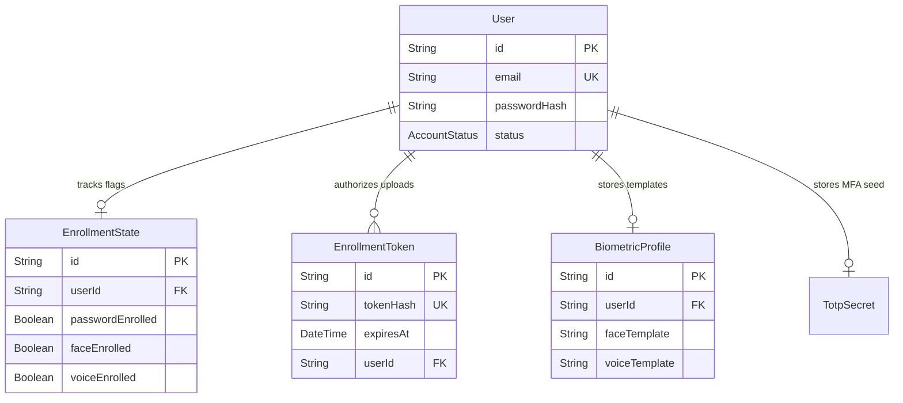

# Registration Identity Analysis — Phase 2.1B

This document analyzes the current registration and biometric enrollment implementation, identifies key architectural identity mismatches, and designs a clean target registration flow with recovery mechanisms.

---

## 1. Current Registration Flow

```text
FirstRunSetup (Welcomes user)
      ↓
EnrollView Form (Collects Name, PIN)
      ↓
localProfileService.createProfile()
      ↓
Local profile written to browser localStorage (e.g. ID = lp-12345)
      ↓
Advance to FACE wizard step (EnrollView is passed lp-12345)
      ↓
Face scanner captures best frame pose
      ↓
POST /api/biometric/register (with no token or user context)
      ↓
Returns 401 Unauthorized (on strict backend) or bypassed/discarded
      ↓
Advance to VOICE wizard step
      ↓
Voice print captured and uploaded
      ↓
Finish Wizard → Redirect to login screen
      ↓
First Login: App.tsx.handleCredentialsSuccess() runs:
  Registers user on backend best-effort (email = lp-12345@bioshield.local, password = Password123!)
  Performs login to get sessionId
```

---

## 2. Current Identity Mapping

* **First Factor:** Local browser `localStorage` acts as the primary registry authority.
* **Credentials:** Plaintext `_devPin` is stored in `localStorage` under `bioshield_local_profiles_v2`.
* **Relational Mapping:** No mapping exists between the client `localStorage` profile and the backend SQLite database `User` table during signup. The backend user is only registered retroactively during first login using a synthesized email (`lp-...@bioshield.local`) and a hardcoded password (`Password123!`).
* **Biometric Mapping:** Face and Voice uploads are submitted without a valid backend user context during first run setup, leading to unlinked biometric templates on the server.

---

## 3. Current Enrollment Flow

* **Primary Setup:** The enrollment wizard captures:
  1. Profile Name & PIN.
  2. Face templates (InsightsFace embedding).
  3. Voice template (harmonious print).
* **MFA Enrollment:** **Absent**. There is no UI screen or workflow to setup/enroll MFA in the frontend. While the backend creates the TOTP secret and generates a QR code upon user registration, it is discarded. The user cannot log in manually because they cannot scan the QR code to register their authenticator app.
* **Workstation Members Setup:** Admin console (`AddProfile.tsx`) registers the user backend-first via `adminApi.createUser` (`POST /api/admin/users`), which creates the user in `ENROLLMENT_REQUIRED` state and returns an `enrollmentToken`. However, it does not append the profile to the browser's `localStorage`, leaving the newly created workstation profile invisible in the lock screen selector.

---

## 4. Database Relationships (Prisma Schema)

The backend database contains dedicated models to support secure registration:



* **`User.status`**: Defaults to `ENROLLMENT_REQUIRED`.
* **`EnrollmentState`**: Holds boolean flags tracking completed enrollment elements: `passwordEnrolled`, `faceEnrolled`, `voiceEnrolled`, and `recoveryConfigured`.
* **`EnrollmentToken`**: Short-lived secure tokens mapped to a specific `userId` to authorize biometric uploads.
* **`BiometricProfile`**: Secure, AES-256 encrypted vector storage for biometric references.

---

## 5. Security & Identity Mismatches

1. **Disconnected Registries:** Profiles created via `FirstRunSetup` exist only in `localStorage`, and backend users created in the Admin console exist only in the database.
2. **Missing MFA Enrollment QR Screen:** Authenticator QR code is never displayed, making manual MFA configuration impossible for end-users.
3. **biometric register Spoofing:** Hitting `/api/biometric/register` without session or token verification allows arbitrary clients to upload biometric templates.

---

## 6. Partial-Registration Problems

We evaluated failure points in the enrollment pipeline and proposed recovery behaviors:

| Failure Case | Root Cause / Impact | Correct Recovery Behavior |
| --- | --- | --- |
| **1. Registration passes, Face fails** | User created in DB but has `status: ENROLLMENT_REQUIRED`. Enrollment token remains valid. | Store `userId` and `enrollmentToken` in the local profile record. On app start, if `faceEnrolled` is false, automatically resume at the face ceremony. |
| **2. Face passes, Voice fails** | Face is written to DB; voice is missing. Session remains incomplete. | Resume setup directly at the voice scan step. |
| **3. Voice passes, MFA fails** | Biometrics completed but MFA setup was closed before saving seed. | Resume setup at the MFA QR display screen. |
| **4. Browser closes mid-way** | Partial user records left in database. | On browser restart, parse the incomplete local profile. Use the saved `enrollmentToken` to resume setup. |
| **5. User already exists** | Re-registering email that failed setup earlier. | The backend `AuthService.register` updates the existing record if status is `ENROLLMENT_REQUIRED`, allowing them to restart the flow. |
| **6. Token expires** | More than 24 hours pass before biometrics enroll. | Return `403 Enrollment Token Expired` from API. UI shows "Enrollment link expired, contact an admin." |
| **7. User exists, no local profile** | User created via Admin console but not present in local browser. | Add a "Retrieve Profile / Sync Profile" option on first run, or write the profile to `localStorage` immediately upon creation in the admin console. |

---

## 7. Local PIN Analysis & Recommendation

We analyzed code references to `validatePin()` and `_devPin`:
* **Usage:** `SecureActionAuthorization.tsx` (entering admin pages) and `ProfileDetails.tsx` (renaming/deleting profiles).
* **Step-Up Verification:** Actual backend step-up reauthentication is handled by the Adaptive Authentication Orchestrator (`AdaptiveAuthenticationService` returning `STEP_UP_REQUIRED` 403), which displays the `StepUpModal` to verify the user's face biometric. The local PIN is never sent to the backend.
* **Recommendation (B): Keep as profile unlock only.** The PIN is suitable as a fast local-first credential to protect cached local workstation preferences (which profile is active, theme, etc.) and authorize profile changes in `ProfileDetails.tsx`. It must be completely decoupled from backend authentication.

---

## 8. Proposed Target Registration Architecture

```text
User enters name, email, password, and role
                     ↓
        POST /api/auth/register
                     ↓
Prisma User created (status: ENROLLMENT_REQUIRED)
Prisma EnrollmentToken created
Prisma EnrollmentState created (passwordEnrolled: true)
                     ↓
Returns: { userId, enrollmentToken, qrCode }
                     ↓
Save LocalProfile to localStorage:
  { id: userId, email: email, userId: userId }
                     ↓
Display MFA QR setup screen (User scans QR into Authenticator app)
                     ↓
Face enrollment (sets x-enrollment-token header with enrollmentToken)
                     ↓
Voice enrollment (sets x-enrollment-token header)
                     ↓
Submit final confirmation code (Verify MFA to validate setup)
                     ↓
Enrollment state check: face & voice & password & MFA verified
                     ↓
Prisma User status → ACTIVE
Registry updated → login unlocked!
```

---

## 9. Files Requiring Modification

1. **[`frontend/components/login/EnrollView.tsx`](file:///c:/Users/Amruth/Desktop/bioshield-mfa-2025%20v9%2031%20july/frontend/components/login/EnrollView.tsx):**
   - Collect `email`, `password`, and `confirmPassword` in step 1.
   - Send `POST /api/auth/register` to register the backend user and retrieve the enrollment token and QR code.
   - Render a new MFA QR setup step before the biometric scan stages.
2. **[`frontend/components/login/FirstRunSetup.tsx`](file:///c:/Users/Amruth/Desktop/bioshield-mfa-2025%20v9%2031%20july/frontend/components/login/FirstRunSetup.tsx):**
   - Clean up navigation flow.
3. **[`frontend/components/profiles/AddProfile.tsx`](file:///c:/Users/Amruth/Desktop/bioshield-mfa-2025%20v9%2031%20july/frontend/components/profiles/AddProfile.tsx):**
   - Call `localProfileService.createProfile` upon receiving a successful user creation response, linking the database `userId` and `email` to the workstation registry.
4. **[`frontend/services/localProfileService.ts`](file:///c:/Users/Amruth/Desktop/bioshield-mfa-2025%20v9%2031%20july/frontend/services/localProfileService.ts):**
   - Support linking `email` and `userId` directly on profile creation.

---

## 10. Recommended Implementation Phases

* **Phase 2.1B-1: Frontend Registration Forms:** Add email, password, and MFA QR display step to `EnrollView.tsx`.
* **Phase 2.1B-2: Enrollment Token Binding:** Update biometric scanner upload wrappers to send the secure `x-enrollment-token` header during enrollment.
* **Phase 2.1B-3: Local Registry Sync:** Update `AddProfile.tsx` to save the created user record to `localStorage`.
* **Phase 2.1B-4: Recovery state machine:** Implement checks for partial setups.

---

## 11. Final Decision

# READY FOR PHASE 2.1B IMPLEMENTATION
